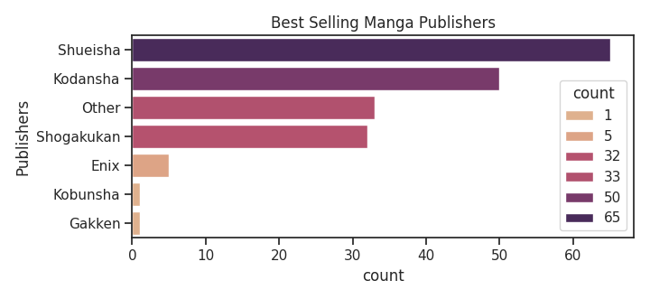

# Manga Dataset EDA:
## Background
I wanted to analyze, clean and then visualize a dataset for the first time! To make things easy for myself, I decided to do a small dataset so that any problems along the way would be more manageable.

## Tools Used
- Python
- Phone
- Notebook

## Data Visuals
### Demographics of Best-selling Manga

### Publication Status of Best-selling Manga

### 

