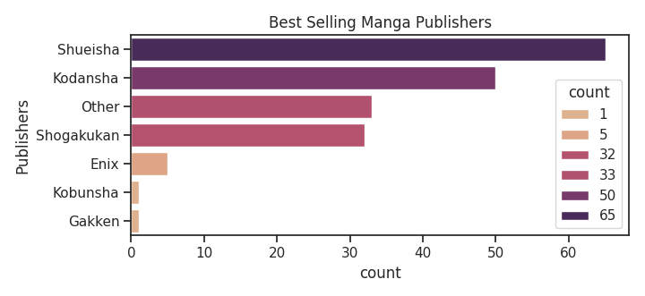
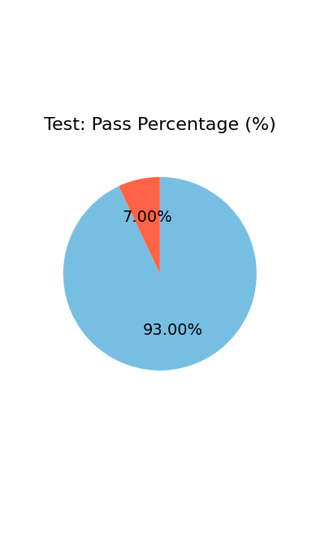

# “Jam Sessions”

Hello and welcome to my project~!

Well, I say that, but the entire purpose behind this `jam sessions` repository is that it becomes a basket for any and all things I do that help develop my programming skills(specifically __python__). 

This will be where all my practice gets shown off, essentially.

__All of my sessions will be posted into 3 categories:__

1. **mini_project_sessions**: this will a collection of small projects to test what I've been learning.

2. **practice_sessions**: a collection of notes and other miscellaneous things.

3. **junk_sessions**: as stated, it's a collection of junk. Don't worry about it.

If you're curious, I'll do my best to regarly update this readme file with my progress. All feedback is welcome.

## Mini-Projects:

1. [logplan_module](1_mini_project_sessions/1_logplan_module) - this is a module with 25 functions that could be used in the logistics planning department(especially packaging).

```python

# 7.
def tot_inserts_per_day(annual_demand, lot_size, inserts_per_bin, total_production_days = 365):
    """
    Calculates the total inserts required per day
    
    :param annual_demand: total parts needed for 1 year(expected to be an integer)
    :param lot_size: lot size of a part(expected to be an integer)
    :param inserts_per_bin: total inserts used per bin(expected to be an integer)
    :param total_production_days: total days of expected production(expected to be an integer)
    :return: the total inserts required per day(expected to be a string)
    """
    tot_bins = annual_demand / lot_size
    tot_bins_per_day = tot_bins / total_production_days
    inserts_required = tot_bins_per_day * inserts_per_bin
    return f"Inserts required per day: {inserts_required:.2f}"

```

2. [one_piece_quiz](1_mini_project_sessions/2_one_piece_quiz) - this quiz tests you on a few basic questions on one piece and scores how well you've done.

```python
# 8. 
giant = input("What is the name of the giant that used to take care of Nico Robin? ").lower()

if giant == "jaguar d. saul":
    score += 1
    print("Correct!")
elif giant == "saul":
    score += .5
    print("Correct!")
else:
    print("Incorrect!")
```

3. [phoebe_adventures](1_mini_project_sessions/3_phoebe_adventures) - this is a "choose your own adventure"-style game that centres around helping Phoebe Erin Class get home.

4. [manga_eda](1_mini_project_sessions/4_manga_eda) - this is my first eda done on the "best-selling-manga.csv" dataset. I even made some charts!



5. [python_test](1_mini_project_sessions/5_python_test) - this is a python test that I developed to score on how well people do on random python questions. It was a fun experience!

```python
def custom_pie_chart(data):
    plt.pie(
    x = data,
    autopct = '%1.2f%%',
    textprops = {'fontsize': 14},
    colors = ['#77BFE2', 'tomato'],
    startangle = 90,
    counterclock = False
    )
    plt.title(
    label = title,
    fontdict = {'fontsize': 16},
    pad = 20
    )
    plt.show()
```


## Practice/Study Notes:

1. [luhn algorithm](2_practice_sessions/luhn_algorithm.py) - this is an algorithm that can help determine if your identification number is legit or not.

```python
def check_luhn(card_no):
    n_digits = len(card_no)
    n_sum = 0
    is_second = False
    
    for i in range(n_digits - 1, -1, -1):
        d = ord(card_no[i]) - ord('0')
        
        if (is_second == True):
            d = d * 2
            
        # We add two digits to handle
        # cases that make two digits after
        # doubling
        
        n_sum += d // 10
        n_sum += d % 10
        
        is_second = not is_second
        
    if (n_sum % 10 == 0):
        return True
    else:
        return False
```
2. [tic_tac_toe](2_practice_sessions/tic_tac_toe.py) - this is a program that allows you to play tic-tac-toe(aka X's and O's).

```python
def victory_for(board, sgn):
            if sgn == "X":
                who = "me"
            elif sgn == "O":
                who = "you"
            else:
                who = None
            cross1 = cross2 = True
            for rc in range(3):
                if board[rc][0] == sgn and board[rc][1] == sgn and board[rc][2] == sgn:
                    return who
                if board[0][rc] == sgn and board[1][rc] == sgn and board[2][rc] == sgn:
                    return who
                if board[rc][rc] != sgn:
                    cross1 = False
                if board[2 - rc][2 - rc] != sgn:
                    cross2 = False
            if cross1 or cross2:
                return who
            return None
```

3. _In Progress_

## Junk Ideas:

1. __As previously stated, it will be a collection of junk. Don't worry about it.__
